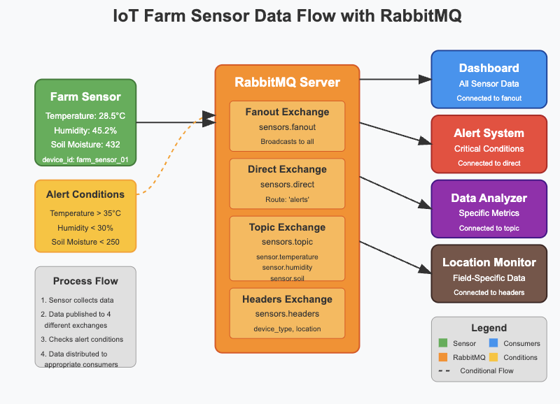

# 🌱 IoT Full Stack Agriculture Monitoring App (Incomplete Version)

This is an incomplete version of the IoT Agriculture Monitoring application designed for classroom teaching. The files contain placeholders (TODOs) that need to be filled in during the lecture.

## 📊 System Architecture



## 🧩 System Components

1. **📡 Sensor Simulator**
   - Generates random data for temperature, humidity, and soil moisture
   - Publishes data to RabbitMQ using different exchange types

2. **🔄 Consumers**
   - 📊 Data Logger: Saves all sensor data to a CSV file
   - ⚠️ Alert Handler: Monitors for abnormal values and prints alerts
   - 🌐 Web Data Server: Forwards data to the dashboard via a Flask API

3. **📱 Dashboard**
   - Simple HTML/JavaScript webpage that displays sensor values and alerts
   - Updates automatically every 2 seconds

## 📋 Prerequisites

- 🐍 Python 3.6+
- 🐰 RabbitMQ Server
- 🌐 Web browser

## 🔧 Installation

1. **📥 Clone the repository**

2. **📦 Install dependencies:**
   ```
   pip install -r requirements.txt
   ```

3. **🚀 Start RabbitMQ Server**
   Make sure RabbitMQ is running on your system.

## 🏃‍♂️ Running the Application

After completing the TODOs during the lecture, you'll run the components in separate terminal windows.

## 📄 Files to Complete During the Lecture

1. **sensors/sensor_emitter.py**
   - Generate sensor data
   - Implement alert conditions
   - Publish to different exchange types

2. **consumers/data_logger.py**
   - Connect to RabbitMQ
   - Create and bind queue
   - Parse and log sensor data

3. **consumers/alert_handler.py**
   - Connect to RabbitMQ with direct exchange
   - Check values against thresholds
   - Format and display alerts

4. **consumers/web_data_server.py**
   - Create RabbitMQ consumer for web data
   - Implement alert check function
   - Create API endpoint

5. **dashboard/index.html**
   - Create sensor card HTML structure
   - Add alert display area
   - Style elements properly

6. **dashboard/app.js**
   - Implement data fetching from API
   - Update dashboard UI with sensor values
   - Handle alerts and visual feedback

## ⚠️ Alert Thresholds

- 🌡️ Temperature: Alert if > 35°C
- 💧 Humidity: Alert if < 30%
- 🌱 Soil Moisture: Alert if < 250 units

## 📁 Project Structure

```
iot_full_stack_app_incomplete/
├── consumers/
│   ├── alert_handler.py
│   ├── data_logger.py
│   └── web_data_server.py
├── dashboard/
│   ├── app.js
│   └── index.html
├── sensors/
│   └── sensor_emitter.py
├── assets/
│   └── iot_architecture.png
├── requirements.txt
└── README.md
``` 